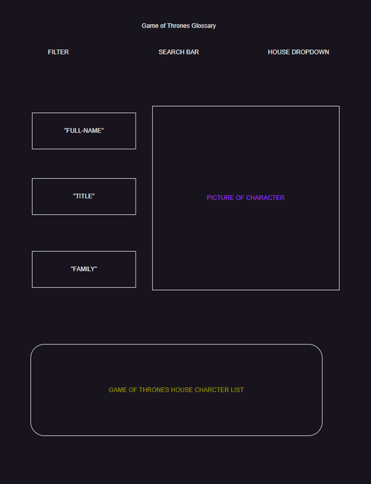

<!-- loremipsum.io

(Figma.com for wire framing or mocking)

--style guides

--user story example

--seed data / example data 
    *atleast 3 example entries
    *include data type

--kanban board: trello (via atlassian) -->

# Game of Thrones Glossary

###  Your one stop shop for GOT character lore

## User Stories
* User allowed to filter Game of Thrones characters to display on page.
* User allowed to search specific character and have character information displayed on page.
* User allowed to filter by "house" name and have list of house members returned

## Deliverables
As a user, I can:
* placeHolder

## Bonus Deliverables
* Use arrow key to move through characters

## Wireframe

## Endpoint

* https://thronesapi.com/
* https://github.com/shevabam/game-of-thrones-quotes-api

## Collaborators

Shukri Hussein ◘ Kuk Hoon Ryou ◘ Michael DiPasquale

